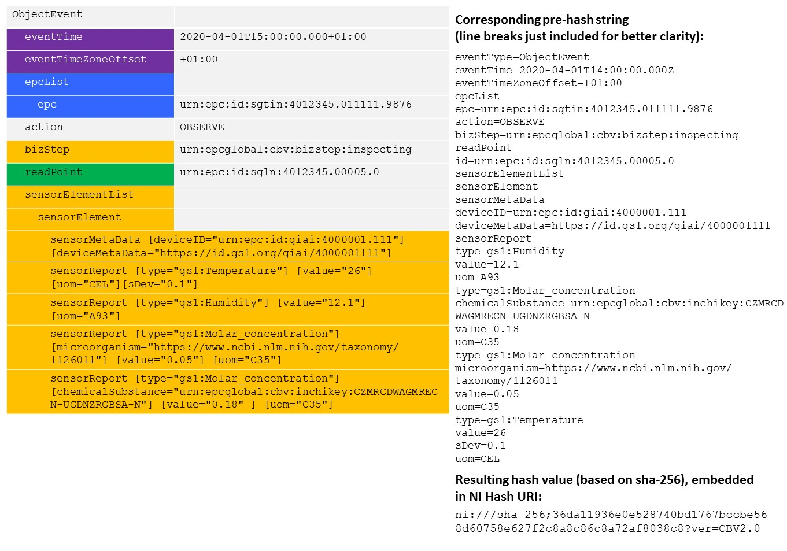

# EPCIS Event Hash Generator

[](https://github.com/RalphTro/epcis-event-hash-generator/actions?query=workflow%3A%22Unit+Tests%22)
[](https://github.com/RalphTro/epcis-event-hash-generator/actions?query=workflow%3A%22Code+Style%22)

This is a proposal/reference implementation for a method to uniquely identify an EPCIS event or validate the integrity thereof. To this end, a syntax-/representation-agnostic approach based on hashing is developed.
The <b>PROTOTYPICAL DEMO SOFTWARE</b> takes an EPCIS Document (either formatted in XML or JSON-LD) and returns the hash value(s) of the contained EPCIS events representing a unique fingerprint of the latter. 


## Usage (TL;DR)
The script may be used as a command line utility like this:
```
python epcis_event_hash_generator/main.py -h
```

Tests are run via
```
cd tests; pytest
```
where pytests needs to be intalles (`pip install pytest`).

## Introduction  
There are situations in which organisations require to uniquely refer to a specific EPCIS event. For instance, companies may only want to store the <b>hash value of a given EPCIS event on a distributed shared ledger ('blockchain')</b> instead of any actual payload. Digitally signed and in conjunction with a unique timestamp, this is a powerful and effective way to prove the integrity of the underlying event data. Another use case consists to use such an approach to <b>populate the eventID field with values that are intrinsic to the EPCIS event</b> - if an organisation captures an event without an eventID (which is not required as of the standard) and sends that event to a business partner who needs to assign a unique ID, they can agree that the business partner populates the eventID field applying this methodology before storing the event on the server. If the organisation later wants to query for that specific event, it knows how the eventID was created, thus is able to query for it through the eventID value.
EPCIS events have a couple of differences to other electronic documents:
+ They are embedded in an EPCIS document that can contain multiple events 
+ As of EPCIS 2.0, it is permitted to capture and share EPCIS data through two different syntaxes (XML and JSON/JSON-LD)
+ EPCIS events provides ample flexibility to include user-specific extensions 
+ When expressed in JSON/JSON-LD, the sequence of elements may vary

This is why industry needs to have a consistent, reliable approach to create a hash value that is viable to uniquely identify a specific EPCIS event. 

Notice that the algorithm described here provides a way of *hashing* an event. A *signature* scheme can be build using this hash, but the hash by itself does not yield a proof of authenticity/authorship. For example, a man in the middle attack can re-compute the hash after tampering.

## Requirements

For any algorithm that is to be considered a faithful hash of an EPCIS event, we require the following properties:

+ Different (valid) serialisations of the **same event** need to yield the **same hash**.
+ In particular, if serialised in XML, the hash must be independend of irrelevant whitespace, ordering of elements in an unordered list, the name used for namespaces, etc. (see e.g. https://en.wikipedia.org/wiki/XML_Signature#XML_canonicalization for more details on the matter).
+ The same event serialised in JSON/JSON-LD or XML must yield the same hash.
+ Any relevant **change of an event** must lead to a **change of the hash**. In particular, the hash must change if
  - any value of any field present in the event is changed.
  - a field is added or removed.


## Algorithm

For hashing strings, well-established algorithms such as SHA-256 are available. The focus of this specification is the canonicalization of a *pre-hash string* representation of an EPCIS event, which can be passed to any standard hashing algorithm. 

To calculate this pre-hash string, the algorithm requires to extract and concatenate EPCIS event key-value pairs to one string exactly according to the following set of rules:
1. For all EPCIS event types, data elements MUST be extracted according to the canonical property order specified below. 
2. All elements MUST be concatenated without a separator, i.e. an empty string between each successive element.
3. If a field contains a value (i.e. is not a parent element), each value MUST be assigned its key through an equal sign ('=').
4. If an EPCIS event comprises ILMD or user extensions elements, the latter MUST be appended to the string comprising their key names (full namespace embraced by curly brackets ('{' and '}') and the respective local name), and, if present, the contained value, prefixed by an equal sign ('='). 
5. Data elements MUST NOT be added if they are omitted in a given EPCIS event or do not apply. 
6. Whitespace characters at the beginning or end of values MUST be cropped. 
7. Quantitative values MUST NOT have trailing zeros (for instance, a quantity of one must be expressed as '1', not '1.0').
8. All timestamps MUST be expressed in UTC. Thereby, the zero UTC offset MUST be expressed with the capital letter 'Z'.  
9. All timestamps MUST be expressed at millisecond precision. If an EPCIS event lacks the latter, it MUST be padded with zeros, i.e. YYYY-MM-DDTHH:MM:SS.000Z.
10. All child elements as part of a list (e.g. epc in epcList, bizTransaction in bizTransactionList, etc.) MUST be sequenced in lexicographical order.
11. If a child element as part of a list comprises one or several key-value pairs itself (e.g. quantityElement in quantityList, sensorReport in sensorElement), the latter MUST be concatenated to a string (similar to the procedure specified above) and, if they belong to the same level, sequenced in lexicographical order.
12. If an EPCIS field comprises a type attribute (e.g. Business Transaction Type in bizTransaction or Source/Destination Type in source), the value MUST be prefixed with the type before the lexicographical ordering takes place.  
13. The resulting pre-hash string MUST be embedded in a 'ni' URI scheme as specified in RFC 6920, as follows: 
ni:///{digest algorithm};{digest value}?ver={CBV version}
i.e. characters 'n', 'i', followed by one colon (':'), three slash characters ('/'), the digest algorithm, one semicolon (';'), the digest value, one question mark ('?'), the characters 'v', 'e', 'r', one equal sign ('='), and the version of the EPCIS Event Hash ID algorithm that was used to generate the pre-hash string, indicated by the cbv version.
14. The digest algorithm MUST contain one of the hash name string values as listed in the Named Information Hash Algorithm Registry (see https://www.iana.org/assignments/named-information/named-information.xhtml) 
15. The cbv version MUST be indicated as follows: the three characters 'c', 'b', 'v', followed by one or several digits indicating the major release version, one dot character ('.') and one or more digits indicating the minor release version. In addition, it MAY be appended with one dot character ('.') and one or more digits indicating a revision of a given CBV standard release, if applicable (i.e. if a revision of the CBV standard specifies an updated version of the EPCIS Event Hash ID algorithm). 

### Canonical property order 
  
<table>
    <thead>
        <tr>
            <th>Seq.</th>
            <th colspan=5>ObjectEvent | AggregationEvent | TransactionEvent | TransformationEvent | AssociationEvent</th>
        </tr>
    </thead>
    <tbody>
        <tr>
            <td>1</td>
            <td colspan=5>eventType</td>
        </tr>
        <tr>
            <td>2</td>
            <td colspan=5>eventTime</td>
        </tr>
        <tr>
            <td>3</td>
            <td colspan=5>eventTimeZoneOffset</td>
        </tr>
        <tr>
            <td>4</td>
            <td colspan=5>errorDeclaration (declarationTime, reason, correctiveEventIDs – correctiveEventID)</td>
        </tr>
        <tr>
            <td>5</td>
            <td colspan=5>epcList – epc</td>
        </tr>
        <tr>
            <td>6</td>
            <td colspan=5>parentID</td>
        </tr>
        <tr>
            <td>7</td>
            <td colspan=5>inputEPCList – epc</td>
        </tr>
        <tr>
            <td>8</td>
            <td colspan=5>childEPCs – epc</td>
        </tr>
        <tr>
            <td>9</td>
            <td colspan=5>quantityList – quantityElement (epcClass, quantity, uom)</td>
        </tr>
        <tr>
            <td>10</td>
            <td colspan=5>childQuantityList – quantityElement (epcClass, quantity, uom)</td>
        </tr>
        <tr>
            <td>11</td>
            <td colspan=5>inputQuantityList – quantityElement (epcClass, quantity, uom)</td>
        </tr>
        <tr>
            <td>12</td>
            <td colspan=5>outputEPCList – epc</td>
        </tr>
        <tr>
            <td>13</td>
            <td colspan=5>outputQuantityList – quantityElement (epcClass, quantity, uom)</td>
        </tr>
        <tr>
            <td>14</td>
            <td colspan=5>action</td>
        </tr>
        <tr>
            <td>15</td>
            <td colspan=5>transformationID</td>
        </tr>
        <tr>
            <td>16</td>
            <td colspan=5>bizStep</td>
        </tr>
        <tr>
            <td>17</td>
            <td colspan=5>disposition</td>
        </tr>
        <tr>
            <td>18</td>
            <td colspan=5>readPoint – id</td>
        </tr>
        <tr>
            <td>19</td>
            <td colspan=5>bizLocation – id</td>
        </tr>
        <tr>
            <td>20</td>
            <td colspan=5>bizTransactionList – bizTransaction (type)</td>
        </tr>
        <tr>
            <td>21</td>
            <td colspan=5>sourceList – source (type)</td>
        </tr>
        <tr>
            <td>22</td>
            <td colspan=5>destinationList – destination (type) </td>
        </tr>
        <tr>
            <td>23</td>
            <td colspan=5>sensorElement (
sensorMetaData (time, startTime, endTime, deviceID, deviceMetaData, rawData, dataProcessingMethod, bizRules), 
sensorReport (type, deviceID, deviceMetaData, rawData, dataProcessingMethod, time, microorganism, chemicalSubstance, value, component, stringValue, booleanValue, hexBinaryValue, uriValue, minValue, maxValue, meanValue, sDev, percRank, percValue, uom)
)
</td>
        </tr>
        <tr>
            <td>24</td>
            <td colspan=5>ilmd – {ILMD elements}</td>
        </tr>
        <tr>
            <td>25</td>
            <td colspan=5>{User extension elements}</td>
        </tr>
    </tbody>
</table>

For better understanding, the following illustration includes the data content of a simple EPCIS event (including a couple of user extensions - all defined under 'https://ns.example.com/epcis'), shows the corresponding pre-hash string as well as the canonical hash value of that event.


The following illustration provides a second example accommodating sensor data.



The line breaks in the pre-hash string are displayed for readability reasons. The actual pre-hash string does not contain any whitespace (unless specifically used in a value) and the lines displayed in the above picture have to be concatenated (by empty string) in order to get the actual pre-hash string.

## Use Cases and Limitations
This algorithm has *various potential areas of application*:
* Primary Key for EPCIS Events
  - populating the eventID field in situations where this is required
  - enabling to independently recalculate the eventID value on the basis of an EPCIS event's intrinsic data
  - indexing EPCIS events in databases
* Identifying duplicate EPCIS events
* Matching an error declaration to an original event (see EPCIS Standard, section 7.4.1.4)
* Notarisation of EPCIS events (i.e. leveraging digital signatures)  

That said, the algorithm has limited applicability when EPCIS events are redacted (meaning that, e.g. for privacy reasons, EPCIS events are not shared entirely, but deliberately omit specific fields or including readPoint IDs with a lesser granularity - see EPCIS and CBV Implementation Guide, section 6.7). In such a case, the content of a redacted EPCIS event will in no case yield to the hash value of the original one.

## References
* EPCIS Standard, v. 1.2: https://www.gs1.org/standards/epcis
* Core Business Vocabulary (CBV) Standard, v. 1.2.2: https://www.gs1.org/standards/epcis
* RFC 6920, Naming Things with Hashes, https://tools.ietf.org/html/rfc6920
* Named Information Hash Algorithm Registry, https://www.iana.org/assignments/named-information/named-information.xhtml


## License

<br />

Copyright 2020 | Ralph Tröger <ralph.troeger@gs1.de> and Sebastian Schmittner <schmittner@eecc.info>

Permission is hereby granted, free of charge, to any person obtaining a copy of this software and associated documentation files (the "Software"), to deal in the Software without restriction, including without limitation the rights to use, copy, modify, merge, publish, distribute, sublicense, and/or sell copies of the Software, and to permit persons to whom the Software is furnished to do so, subject to the following conditions:

The above copyright notice and this permission notice shall be included in all copies or substantial portions of the Software.

THE SOFTWARE IS PROVIDED "AS IS", WITHOUT WARRANTY OF ANY KIND, EXPRESS OR IMPLIED, INCLUDING BUT NOT LIMITED TO THE WARRANTIES OF MERCHANTABILITY, FITNESS FOR A PARTICULAR PURPOSE AND NONINFRINGEMENT. IN NO EVENT SHALL THE AUTHORS OR COPYRIGHT HOLDERS BE LIABLE FOR ANY CLAIM, DAMAGES OR OTHER LIABILITY, WHETHER IN AN ACTION OF CONTRACT, TORT OR OTHERWISE, ARISING FROM, OUT OF OR IN CONNECTION WITH THE SOFTWARE OR THE USE OR OTHER DEALINGS IN THE SOFTWARE.
