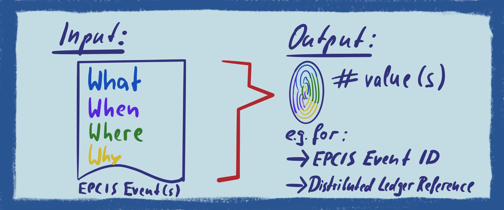

# epcis-event-hash-generator
This is a proposal/reference implementation for a method to uniquely identify an EPCIS event or validate the integrity thereof. To this end, a syntax-/representation-agnostic approach based on hashing is developed.
The <b>PROTOTYPAL DEMO SOFTWARE</b> takes an EPCIS Document (either formatted in XML or JSON-LD) and returns the hash value(s) of the contained EPCIS events representing a unique fingerprint of the latter. 




## Usage (for the inconvenient)
The script may be used as a command line utility like so:
```
python src/EpcisEventHashGenerator.py test/sensorObjectEvent.xml
```


## Introduction  
There are situations in which organisations require to uniquely refer to a specific EPCIS event. For instance, companies may only want to store the <b>hash value of a given EPCIS event on a distributed shared ledger ('blockchain')</b> instead of any actual payload. Digitally signed and in conjunction with a unique timestamp, this is a powerful and effective way to prove the integrity of the underlying event data. Another use case consists to use such an approach to <b>populate the eventID field with values that are intrinsic to the EPCIS event</b> - if an organisation captures an event without an eventID (which is not required as of the standard) and sends that event to a business partner who needs to assign a unique ID, they can agree that the business partner populates the eventID field applying this methodology before storing the event on the server. If the organisation later wants to query for that specific event, it knows how the eventID was created, thus is able to query for it through the eventID.
EPCIS events have a couple of differences to other electronic documents:
+ They are embedded in an EPCIS document that can contain multiple events 
+ As of EPCIS 2.0, it is permitted to capture and share EPCIS data through two different syntaxes (XML and JSON-LD)
+ EPCIS events provides ample flexibility to include user-specific extensions 
+ When expressed in JSON-LD, the sequence of elements may vary

This is why industry needs to have a consistent, reliable approach to create a hash value that is viable to uniquely identify a specific EPCIS event. 


## Requirements

For any algorithm that is to be considered a faithful hash of an EPCIS event, we require the following properties:

+ Different (valid) serialisations of the **same event** need to yield the **same hash**.
+ In particular, if serialised in XML, the hash must be independend of irrelevant whitespace, ordering of elements in an unordered list, the name used for namespaces, etc. See e.g. https://en.wikipedia.org/wiki/XML_Signature#XML_canonicalization for more details on the matter.
+ The same event serialised in JSON-LD or XML must yield the same hash.
+ Any relevant **change of an event** must lead to a **change of the hash**. In particular, the hash must change if
  - any value of any field present in the event is changed.
  - a field is added or removed.


## Algorithm

For hashing strings, standard implementations of the relevant hash algorithms (such as sha256) are avaiable for all relevant languages. Hence the focus here is on deriving a so-called *pre-hash string* representation of an EPCIS event which fulfils the above requirements and can subsequently be passed to a standard hashing algorithm.

To calculate the pre-hash string, extract and concatenate the values of EPCIS event attributes according to the following sequence, i.e. in exactly this order. Note that all values MUST be added in the identical order as specified below (corresponding to the order in which they are specified in the EPCIS standard). Data MUST NOT be added if any field is omitted in a given event or does not apply. Whitespace at the beginning and end of string values is to be cropped (by the definition of XML).
  
<table>
    <thead>
        <tr>
            <th>Seq.</th>
            <th>ObjectEvent</th>
            <th>AggregationEvent</th>
            <th>TransactionEvent</th>
            <th>TransformationEvent</th>
            <th>AssociationEvent</th>
        </tr>
    </thead>
    <tbody>
        <tr>
            <td>1</td>
            <td colspan=5>eventTime</td>
        </tr>
        <tr>
            <td>2</td>
            <td colspan=5>eventTimeZoneOffset</td>
        </tr>
        <tr>
            <td>3</td>
            <td colspan=5>eventID</td>
        </tr>
        <tr>
            <td/>
            <td colspan=5><i>Note: Even if an event ID value is already present (which is NOT required!), this method may still be beneficial, e.g. when organisations require to store a unique fingerprint of EPCIS events on a distributed shared ledger.<i/></td>
        </tr>
        <tr>
            <td>4</td>
            <td colspan=5>ErrorDeclaration – declarationTime</td>
        </tr>
        <tr>
            <td>5</td>
            <td colspan=5>ErrorDeclaration – reason</td>
        </tr>
        <tr>
            <td>6</td>
            <td colspan=5>ErrorDeclaration – correctiveEventIDs</td>
        </tr>
        <tr>
            <td/>
            <td colspan=5><i>All individual event IDs being part of the correctiveEventIDs element MUST be sequenced in lexicographical order</i></td>
        </tr>
       <tr>
          <td>7</td>
          <td colspan=2>-</td>
          <td>bizTransactionList – bizTransaction</td>
          <td colspan=2>-</td>
      </tr>
      <tr>
        <td/>
        <td colspan=5><i>All individual bizTransaction IDs being part of the bizTransactionList MUST be sequenced in lexicographical order  </i></td>
      </tr>
      <tr>
            <td>8</td>
            <td>epcList – epc </td>
            <td>parentID, prefixed with one lowercase letter 'p'</td>
            <td>parentID, prefixed with one lowercase letter 'p'</td>
            <td>inputEPCList – epc, <b>prefixed with the two lowercase letters 'ie', followed by the epc values</td>
            <td>parentID, prefixed with one lowercase letter 'p'</td>
        </tr>
        <tr>
            <td/>
            <td colspan=5><i>All EPC/EPC Class values being part of the respective lists MUST be sequenced in lexicographical order</i>             </td>
        </tr>
        <tr>
            <td>9</td>
            <td>quantityList - epcClass</td>
            <td>childEPCs – epc</td>
            <td>epcList – epc</td>
            <td>inputQuantityList – epcClass, prefixed with the two lowercase letters 'iq', followed by the quantity values</td></td>
            <td>childEPCs – epc</td>
        </tr>
        <tr>
            <td>10</td>
            <td>-</td>
            <td>childQuantityList – epcClass</td>
            <td>quantityList - epcClass</td>
            <td>outputEPCList – epc, prefixed with the two lowercase letters 'oe', followed by the epc values</td></td>
            <td>childQuantityList – epcClassc</td>
        </tr>
        <tr>
            <td>11</td>
            <td colspan=3>-</td>
            <td>outputQuantityList – epcClass, prefixed with the two lowercase letters 'oq', followed by the quantity values</td></td>
            <td colspan=1>-</td>
        </tr>
        <tr>
            <td>12</td>
            <td>action</td>
            <td>action</td>
            <td>action</td>
            <td>transformationID</td>
            <td>action</td>
        </tr>
        <tr>
            <td>13</td>
            <td colspan=5>bizStep</td>
        </tr>
        <tr>
            <td>14</td>
            <td colspan=5>disposition</td>
        </tr>
        <tr>
            <td>15</td>
            <td colspan=5>readPoint</td>
        </tr>
        <tr>
            <td>16</td>
            <td colspan=5>bizLocation</td>
        </tr>
        <tr>
            <td>17</td>
            <td colspan=2>bizTransactionList – bizTransaction</td>
            <td>-</td>
            <td colspan=2>bizTransactionList – bizTransaction</td>
        </tr>
        <tr>
            <td>18</td>
            <td colspan=5>sourceList – source</td>
        </tr>
        <tr>
            <td>19</td>
            <td colspan=5>destinationList – destination</td>
        </tr>
        <tr>
            <td/>
            <td colspan=5><i>All individual source/destination IDs being part of the respective lists MUST be sequenced in lexicographical order</td>
        </tr>
        <tr>
            <td>20</td>
            <td colspan=5>sensorElement – sensorMetaData – time</td>
        </tr>
        <tr>
            <td>21</td>
            <td colspan=5>sensorElement – sensorMetaData – startTime</td>
        </tr>
        <tr>
            <td>22</td>
            <td colspan=5>sensorElement – sensorMetaData – endTime</td>
        </tr>
        <tr>
            <td>23</td>
            <td colspan=5>sensorElement – sensorMetaData – deviceID</td>
        </tr>
        <tr>
            <td>24</td>
            <td colspan=5>sensorElement – sensorMetaData – deviceMetaData</td>
        </tr>
        <tr>
            <td>25</td>
            <td colspan=5>sensorElement – sensorMetaData – rawData</td>
        </tr>
        <tr>
            <td>26</td>
            <td colspan=5>sensorElement – sensorMetaData – dataProcessingMethod</td>
        </tr>
        <tr>
            <td>27</td>
            <td colspan=5>sensorElement – sensorMetaData – bizRules</td>
        </tr>
        <tr>
            <td>28</td>
            <td colspan=5>sensorElement – sensorReport – type</td>
        </tr>
        <tr>
            <td>29</td>
            <td colspan=5>sensorElement – sensorReport – deviceID</td>
        </tr>
        <tr>
            <td>30</td>
            <td colspan=5>sensorElement – sensorReport – deviceMetaData</td>
        </tr>
        <tr>
            <td>31</td>
            <td colspan=5>sensorElement – sensorReport – rawData</td>
        </tr>
        <tr>
            <td>32</td>
            <td colspan=5>sensorElement – sensorReport – dataProcessingMethod</td>
        </tr>
        <tr>
            <td>33</td>
            <td colspan=5>sensorElement – sensorReport – time</td>
        </tr>
        <tr>
            <td>34</td>
            <td colspan=5>sensorElement – sensorReport – microorganism</td>
        </tr>
        <tr>
            <td>35</td>
            <td colspan=5>sensorElement – sensorReport – chemicalSubstance</td>
        </tr>
        <tr>
            <td>36</td>
            <td colspan=5>sensorElement – sensorReport – value</td>
        </tr>
        <tr>
            <td>37</td>
            <td colspan=5>sensorElement – sensorReport – stringValue</td>
        </tr>
        <tr>
            <td>38</td>
            <td colspan=5>sensorElement – sensorReport – booleanValue</td>
        </tr>
        <tr>
            <td>39</td>
            <td colspan=5>sensorElement – sensorReport – hexBinaryValue</td>
        </tr>
        <tr>
            <td>40</td>
            <td colspan=5>sensorElement – sensorReport – uriValue</td>
        </tr>
        <tr>
            <td>41</td>
            <td colspan=5>sensorElement – sensorReport – minValue</td>
        </tr>
        <tr>
            <td>42</td>
            <td colspan=5>sensorElement – sensorReport – maxValue</td>
        </tr>
        <tr>
            <td>43</td>
            <td colspan=5>sensorElement – sensorReport – meanValue</td>
        </tr>
        <tr>
            <td>44</td>
            <td colspan=5>sensorElement – sensorReport – sDev</td>
        </tr>
        <tr>
            <td>45</td>
            <td colspan=5>sensorElement – sensorReport – percRank</td>
        </tr>
        <tr>
            <td>46</td>
            <td colspan=5>sensorElement – sensorReport – percValue</td>
        </tr>
        <tr>
            <td>47</td>
            <td colspan=5>sensorElement – sensorReport – uom</td>
        </tr>
        <tr>
            <td>48</td>
            <td colspan=5>ILMD</td>
            <td colspan=5><i>All ILMD field values, irrespective of their level and field name, MUST be sequenced in lexicographical order</td>
        </tr>
        <tr>
            <td>49</td>
            <td colspan=5>User extensions</td>
            <td colspan=5><i>All user extension field values, irrespective of their level and field name, MUST be sequenced in lexicographical order</td>
        </tr>
    </tbody>
</table>

## Installation
tbd

## References
* EPCIS Standard, v. 1.2: https://www.gs1.org/standards/epcis
* Core Business Vocabulary (CBV) Standard, v. 1.2.2: https://www.gs1.org/standards/epcis


## License

<br />

Copyright 2019 Ralph Tröger <ralph.troeger@gs1.de>, Sebastian Schmittner (schmittner@eecc.info)

Permission is hereby granted, free of charge, to any person obtaining a copy of this software and associated documentation files (the "Software"), to deal in the Software without restriction, including without limitation the rights to use, copy, modify, merge, publish, distribute, sublicense, and/or sell copies of the Software, and to permit persons to whom the Software is furnished to do so, subject to the following conditions:

The above copyright notice and this permission notice shall be included in all copies or substantial portions of the Software.

THE SOFTWARE IS PROVIDED "AS IS", WITHOUT WARRANTY OF ANY KIND, EXPRESS OR IMPLIED, INCLUDING BUT NOT LIMITED TO THE WARRANTIES OF MERCHANTABILITY, FITNESS FOR A PARTICULAR PURPOSE AND NONINFRINGEMENT. IN NO EVENT SHALL THE AUTHORS OR COPYRIGHT HOLDERS BE LIABLE FOR ANY CLAIM, DAMAGES OR OTHER LIABILITY, WHETHER IN AN ACTION OF CONTRACT, TORT OR OTHERWISE, ARISING FROM, OUT OF OR IN CONNECTION WITH THE SOFTWARE OR THE USE OR OTHER DEALINGS IN THE SOFTWARE.
