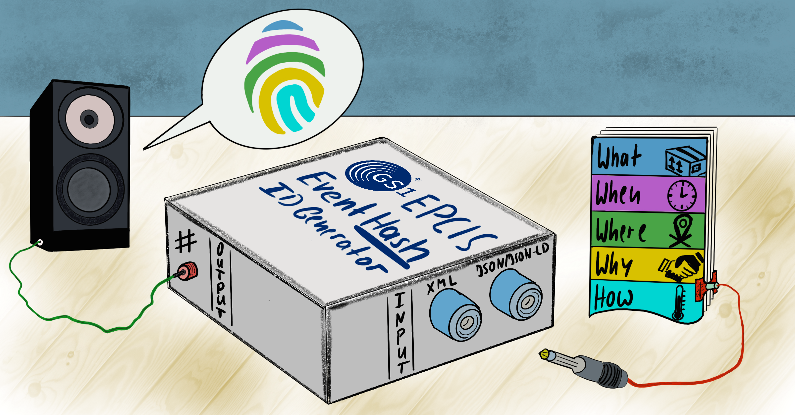
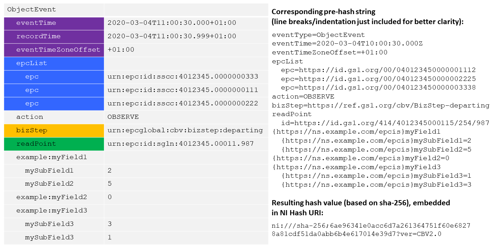
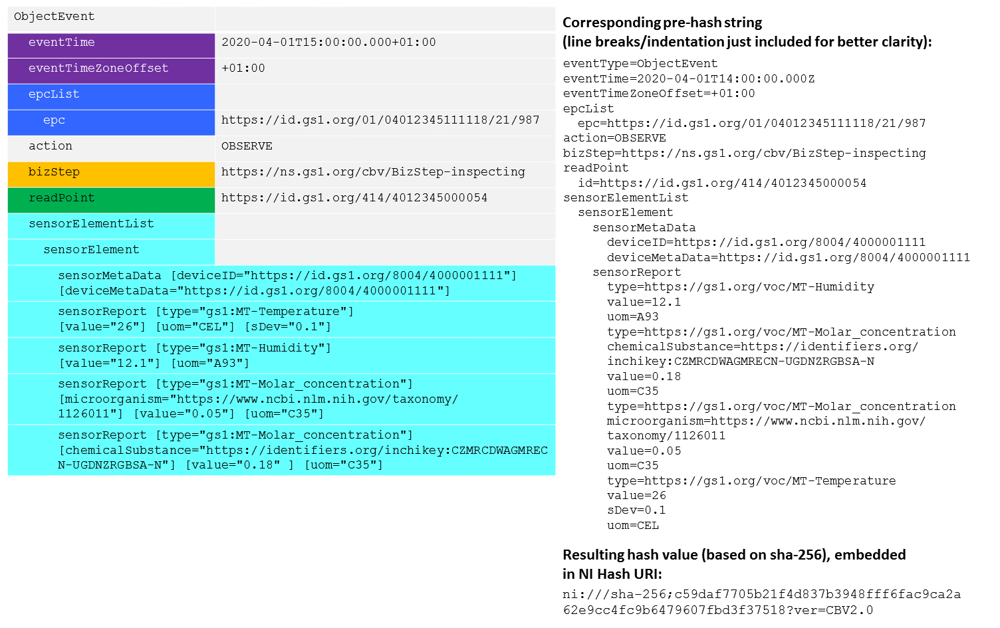
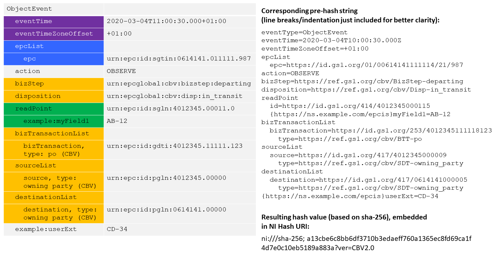

[](https://github.com/RalphTro/epcis-event-hash-generator/actions/workflows/pytest.yml)

# EPCIS Event Hash Generator

This is a reference implementation of the _EPCIS Event Hash ID_ algorithm defined in the GS1 Core Business Vocabulary (
CBV) Standard. It supports the ratified **CBV 2.0** algorithm and the draft **CBV 2.1**. The algorithm is
representation-agnostic: it takes an EPCIS document (XML or JSON/JSON-LD) and returns a hash value for each contained
event that serves as a unique fingerprint of that event.

This is <b>PROTOTYPICAL DEMO SOFTWARE</b>. Use it to test your own implementation against a known-good reference, not in
production.



## Status of the reference implementation

Working as expected, no known major bugs. CBV 2.0 is the default. CBV 2.1 is a draft, so its output may still change as
the standard is finalised; select it explicitly with `-v CBV2.1`.

## TL;DR

This is a prototypical reference implementation meant for testing against other implementations, **not for production**.
If you find that it does not conform to the algorithm description, or hit any other bug, please file an issue
at https://github.com/RalphTro/epcis-event-hash-generator/issues .

## Installation and command line usage

The algorithm is packaged as a Python module with a command line utility. The package is released on PyPI
at https://pypi.org/project/epcis-event-hash-generator/ , so you can install it with:

```
python3 -m pip install epcis_event_hash_generator
```

Run it against a document:

```
python3 -m epcis_event_hash_generator tests/examples/documents/ReferenceEventHashAlgorithm.xml
```

For the full list of options:

```
python3 -m epcis_event_hash_generator -h
```

Useful flags:

| Flag | Purpose                                                                                          |
|------|--------------------------------------------------------------------------------------------------|
| `-v` | CBV version of the algorithm, `CBV2.0` (default) or `CBV2.1`                                     |
| `-a` | hash algorithm: `sha256` (default), `sha3-256`, `sha384`, `sha512`                               |
| `-p` | also print the pre-hash string                                                                   |
| `-j` | delimiter used when displaying the pre-hash string, e.g. `-j "\n"` to print one element per line |
| `-b` | batch mode: write a `<name>.hashes` file next to each input instead of printing                  |
| `-e` | force the parser, `XML` or `JSON`, instead of detecting it from the file extension               |

The `-j` delimiter only affects how the pre-hash string is displayed. The hash is always computed from the
delimiter-free string.

## Introduction

There are situations in which organisations need to refer to a specific EPCIS event unambiguously. For instance, a
company may want to store only the <b>hash value of an EPCIS event on a distributed shared ledger ('blockchain')</b>
rather than the payload itself. Digitally signed and combined with a trusted timestamp, that is an effective way to
prove the integrity of the underlying event data. Another use case is to <b>populate the `eventID` field with a value
derived from the event itself</b>. If an organisation captures an event without an `eventID` (the field is optional in
the standard) and sends it to a partner who needs a unique ID, they can agree that the partner fills the `eventID` using
this method before storing the event. When the organisation later queries for that event, it can recompute the
same `eventID` and query by it.

EPCIS events differ from other electronic documents in a few ways:

- They are embedded in an EPCIS document, which can contain many events.
- As of EPCIS 2.0, the same data can be captured and shared in two syntaxes (XML and JSON/JSON-LD).
- Events allow user-specific extensions.
- In JSON/JSON-LD, the order of elements may vary.

Hence industry needs one consistent, reliable way to compute a hash that uniquely identifies a specific EPCIS event.

The algorithm here _hashes_ an event. A signature scheme can be built on top of this hash, but the hash on its own does
not prove authenticity or authorship. A man-in-the-middle can recompute the hash after tampering with the data.

## Required properties of the hash

For an algorithm to be a faithful hash of an EPCIS event, it has to satisfy the following:

- Different valid serialisations of the **same event** yield the **same hash**.
- In XML, the hash is independent of insignificant whitespace, the order of elements in an unordered list, the namespace
  prefixes used, and similar syntactic choices (see https://en.wikipedia.org/wiki/XML_Signature#XML_canonicalization for
  background).
- The same event serialised in JSON/JSON-LD or XML yields the same hash.
- Any relevant **change to an event** changes the hash. In particular, the hash changes if:
    - any value of any field in the event changes.
    - a field is added or removed.

## Algorithm

### Versions

| Version | Status             | Summary                                                                                                                               |
|---------|--------------------|---------------------------------------------------------------------------------------------------------------------------------------|
| CBV 2.0 | Ratified (default) | The EPCIS Event Hash ID algorithm as defined in CBV 2.0.                                                                              |
| CBV 2.1 | Draft              | Clarifies timestamp rounding, list naming, and user extension placement. A draft revision also adds handling for `gs1:masterDataAvailableFor` (work in progress, see rule 25). |

The two versions share the same core procedure. Where they differ, the rules below carry a **Note (v2.1)** marker, and
the [differences section](#differences-between-cbv-20-and-21) summarises them.

### Calculation procedure

Well-established algorithms such as SHA-256 handle the actual hashing. What this specification defines is the
canonicalization of a _pre-hash string_, a single string built from the event that is then passed to a standard hash
function.

To build the pre-hash string, extract and concatenate the event's key-value pairs exactly according to the following
rules:

1. For all EPCIS event types, data elements SHALL be extracted according to the _canonical property order_ specified
   below.
2. All elements SHALL be concatenated without separators between successive elements.
3. If a field contains a value (i.e. is not a parent element), each value SHALL be assigned its key through an equal
   sign ('=').
4. Data elements SHALL NOT be added if they are omitted in a given EPCIS event or do not apply.
5. Whitespace characters at the beginning or end of values SHALL be truncated.
6. Quantitative values SHALL NOT have trailing zeros. (For example, a quantity of one SHALL be expressed as '1', and
   SHALL NOT be expressed as '1.0'; 0.3434 SHALL be expressed as
   0.3434, with any trailing zeros truncated.)
7. Numeric values SHALL be expressed without single quotes.
8. All timestamps SHALL be expressed in UTC; the zero UTC offset SHALL be expressed with the capital letter 'Z'.
9. All timestamps SHALL be expressed with millisecond precision. If an EPCIS event lacks the latter, the millisecond
   field SHALL be zero-filled with '000' (e.g., YYYY-MM-DDTHH:MM:
   SS.000Z).
   > **Note (v2.1):** `xsd:dateTimeStamp` permits an unlimited number of decimal places. If more than 3 decimal places
   are expressed, the 3rd decimal place SHALL be
   rounded up when the 4th decimal place is a digit in the range 5-9 (round half-up). For example,
   an `xsd:dateTimeStamp` value of 2023-01-18T11:04:03.1415Z appears in the pre-hash string as
   2023-01-18T11:04:03.142Z .
10. Strings SHALL be sorted according to their case-sensitive lexical ordering, considering UTF-8/ASCII code values of
    each successive character.
11. All child elements as part of a list (e.g. `epc` in `epcList`, `bizTransaction` in `bizTransactionList`, etc.) SHALL
    be sequenced according to their case-sensitive lexical
    ordering, considering UTF-8/ASCII code values of each successive character.
    > **Note (v2.1):** A field name denoting a sensorElementList SHALL also
    only appear once in the pre-hash string.
12. If a child element of a list itself comprises one or more key-value pairs itself (e.g. `quantityElement`
    in `quantityList`, `sensorReport` in `sensorElement`), the latter SHALL
    be concatenated to a string (similar to the procedure specified above) and, if they belong to the same level,
    sequenced according to their case-sensitive lexical ordering,
    considering UTF-8/ASCII code values of each successive character.
13. If an EPCIS field comprises a type attribute (e.g. Business Transaction Type in bizTransaction or Source/Destination
    Type in source), the value SHALL be prefixed with the type
    before the alphabetical ordering takes place.
14. If present, any URN-based standard vocabulary value (starting with 'urn:epcglobal:cbv') SHALL be expressed in its
    corresponding CBV Web URI term (starting
    with 'https://ref.gs1.org').
    Example: 'urn:epcglobal:cbv:bizstep:receiving' --> 'https://ref.gs1.org/cbv/BizStep-receiving'
15. If present, any Compact URI Expression (CURIE) value SHALL be expanded to its full URI equivalent. This also holds
    true for standard CBV values, i.e. with the CURIE prefix
    expansions 'gs1' (https://ref.gs1.org/voc/) and 'cbv' (https://ref.gs1.org/cbv/). Example: 'cbv:
    BizStep-receiving' --> 'https://ref.gs1.org/cbv/BizStep-receiving'
16. If an EPCIS event is represented in JSON/JSON-LD, standard vocabulary elements are not expressed as URIs, but in
    bare string notation (i.e. 'in_transit' instead
    of 'https://ref.gs1.org/cbv/Disp-in_transit'). All standard vocabulary elements expressed in bare string notation
    SHALL be expanded to their corresponding GS1 Web URI (starting
    with 'https://ref.gs1.org/cbv').
17. If present, EPC URIs (starting with 'urn:epc:id'), EPC Class URIs (starting with 'urn:epc:class') or EPC Pattern
    URIs (starting with 'urn:epc:idpat') SHALL be converted into
    the corresponding canonical GS1 Digital Link URI (starting with 'https://id.gs1.org'). Canonical GS1 Digital Link
    URIs are specified
    in [GS1 Digital Link: URI Syntax, release 1.2], section 4.11.
18. If a GS1 Digital Link URI is present, it SHALL take the form of a constrained canonical GS1 Digital Link URI.
    Specifically: (I) A custom domain SHALL be replaced
    by 'https://id.gs1.org'. (II) The query string SHALL be stripped off. (III) It SHALL only contain the most
    fine-granular level of identification, i.e. contain the following GS1
    keys/key qualifiers
    only: `00 / 01 / 01 21 / 01 10 / 01 235 / 253 / 255 / 401 / 402 / 414 / 414 254 / 417 / 8003 / 8004 / 8006 / 8006 21 / 8006 10 / 8010 / 8010 8011 / 8017 / 8018`
19. If an EPCIS event comprises `ILMD` elements, the latter SHALL comprise their key names (full namespace embraced by
    curly brackets ('{' and '}') and the respective local name),
    as well as, if present, the contained value, prefixed by an equal sign ('='). The resulting substrings SHALL be
    sorted according to their case-sensitive lexical ordering,
    considering UTF-8/ASCII code values of each successive character when they are appended to the pre-hash string.
20. If an EPCIS event comprises user extension elements at event level – irrespective whether they appear at top level
    or are nested – the latter SHALL comprise their key names (
    full namespace embraced by curly brackets ('{' and '}') and the respective local name), as well as, if present, the
    contained value, prefixed by an equal sign ('=').
    The resulting substrings SHALL be sorted according to their case-sensitive lexical ordering, considering UTF-8/ASCII
    code values of each successive character when they are
    appended to the pre-hash string.
21. If an EPCIS event comprises user extension elements as part of an EPCIS standard field with an extension point (
    namely `readPoint`, `bizLocation`, `sensorElement`, `sensorMetadata`, and `sensorReport`), they SHALL be added at
    the end of its enclosing parent's regular fields. Apart from
    that, they SHALL be added to the pre-hash string similarly as specified in the previous step.
    > **Note (v2.1):** The wording was clarified. A user extension that sits inside a standard field stays with that
    > field: it is written right after the field's own regular sub-fields, rather than being moved to the trailing block
    > used for event-level extensions (rule 20). For example, an extension inside `readPoint` appears immediately after
    > `readPoint`'s `id`.
22. The resulting pre-hash string SHALL be embedded in a 'ni' URI scheme as specified in RFC 6920, as follows:
    ni:///{digest algorithm};{digest value}?ver={CBV version}
    i.e. characters 'n', 'i', followed by one colon (':'), three slash characters ('/'), the digest algorithm, one
    semicolon (';'), the digest value, one question mark ('?'), the
    characters 'v', 'e', 'r', one equal sign ('='), and the version of the EPCIS Event Hash ID algorithm that was used
    to generate the pre-hash string, indicated by the CBV
    version.
23. The digest algorithm SHALL contain one of the hash name string values as listed in the Named Information Hash
    Algorithm Registry (
    see https://www.iana.org/assignments/named-information/named-information.xhtml)
24. The CBV version SHALL be indicated as follows: the three characters 'C', 'B', 'V', followed by one or several digits
    indicating the major release version, one dot
    character ('.') and one or more digits indicating the minor release version. In addition, it MAY be appended with
    one dot character ('.') and one or more digits indicating a
    revision of a given CBV standard release, if applicable (i.e. if a revision of the CBV standard specifies an updated
    version of the EPCIS Event Hash ID algorithm).
25. **(Draft, work in progress.)** This step comes from a CBV 2.1 draft revision and is not yet confirmed in a ratified
    standard. Support for it in this reference implementation is incomplete, so treat both the rule and its output as
    provisional and subject to change.
    If an EPCIS Event includes the `gs1:masterDataAvailableFor` property, it SHALL be processed analogously to a user
    extension during pre-hash string construction.
    The GS1 Web Vocabulary is unique in that its properties and code values are expressed in bare string notation, i.e.,
    without a URI prefix. For hashing purposes, they are
    treated like standard EPCIS fields:
    • Key names SHALL be used in their original form.
    • Code values SHALL be expanded to their full URI form.
    Each `gs1:masterDataAvailableFor` block includes an `@id` or `id` field that unambiguously identifies the RDF
    Subject. During pre-hash string construction, this field SHALL be
    normalised to "id".
    Similarly, if a `gs1:masterDataAvailableFor` block includes an `@type` or `type` field, it SHALL be normalised to "
    type" during pre-hash string construction.
    > **Note (v2.1):** Step added.

### Canonical property order

Applicable for all EPCIS Event Types, i.e. `ObjectEvent`, `AggregationEvent`, `TransactionEvent`, `TransformationEvent`
and `AssociationEvent`.

| Sequence | Data Element                                                                                                                                                                                                                                                                                                                                     |
|----------|--------------------------------------------------------------------------------------------------------------------------------------------------------------------------------------------------------------------------------------------------------------------------------------------------------------------------------------------------|
| 1        | `eventType`                                                                                                                                                                                                                                                                                                                                      |
| 2        | `eventTime`                                                                                                                                                                                                                                                                                                                                      |
| 3        | `eventTimeZoneOffset`                                                                                                                                                                                                                                                                                                                            |
| 4        | `epcList` – `epc`                                                                                                                                                                                                                                                                                                                                |
| 5        | `parentID`                                                                                                                                                                                                                                                                                                                                       |
| 6        | `inputEPCList` – `epc`                                                                                                                                                                                                                                                                                                                           |
| 7        | `childEPCs` – `epc`                                                                                                                                                                                                                                                                                                                              |
| 8        | `quantityList` – `quantityElement` (`epcClass`, `quantity`, `uom`)                                                                                                                                                                                                                                                                               |
| 9        | `childQuantityList` – `quantityElement` (`epcClass`, `quantity`, `uom`)                                                                                                                                                                                                                                                                          |
| 10       | `inputQuantityList` – `quantityElement` (`epcClass`, `quantity`, `uom`)                                                                                                                                                                                                                                                                          |
| 11       | `outputEPCList` – `epc`                                                                                                                                                                                                                                                                                                                          |
| 12       | `outputQuantityList` – `quantityElement` (`epcClass`, `quantity`, `uom`)                                                                                                                                                                                                                                                                         |
| 13       | `action`                                                                                                                                                                                                                                                                                                                                         |
| 14       | `transformationID`                                                                                                                                                                                                                                                                                                                               |
| 15       | `bizStep`                                                                                                                                                                                                                                                                                                                                        |
| 16       | `disposition`                                                                                                                                                                                                                                                                                                                                    |
| 17       | `persistentDisposition` - (`set`, `unset`)                                                                                                                                                                                                                                                                                                       |
| 18       | `readPoint` – `id`                                                                                                                                                                                                                                                                                                                               |
| 19       | `bizLocation` – `id`                                                                                                                                                                                                                                                                                                                             |
| 20       | `bizTransactionList` – `bizTransaction` (`business transaction identifier`, `business transaction type`)                                                                                                                                                                                                                                         |
| 21       | `sourceList` – `source` (`source ID`, `source type`)                                                                                                                                                                                                                                                                                             |
| 22       | `destinationList` – `destination` (`destination ID`, `destination type`)                                                                                                                                                                                                                                                                         |
| 23       | `sensorElementList` - `sensorElement` (                                                                                                                                                                                                                                                                                                          |
|          | `sensorMetadata` (`time`, `startTime`, `endTime`, `deviceID`, `deviceMetadata`, `rawData`, `dataProcessingMethod`, `bizRules`),                                                                                                                                                                                                                  |
|          | `sensorReport` (`type`, `exception`, `deviceID`, `deviceMetadata`, `rawData`, `dataProcessingMethod`, `time`, `microorganism`, `chemicalSubstance`, `value`, `component`, `stringValue`, `booleanValue`, `hexBinaryValue`, `uriValue`, `minValue`, `maxValue`, `meanValue`, `sDev`, `percRank`, `percValue`, `uom`, `coordinateReferenceSystem`) |
|          | )                                                                                                                                                                                                                                                                                                                                                |
| 24       | `ilmd` – `{ILMD elements}`                                                                                                                                                                                                                                                                                                                       |
| 25       | `{User extension elements}`                                                                                                                                                                                                                                                                                                                      |

Fields deliberately excluded from the hash: `recordTime`, `eventID`, `type` (the JSON/JSON-LD event-type
key), `errorDeclaration`, and `certificationInfo`.

### Differences between CBV 2.0 and 2.1

For most events, CBV 2.0 and 2.1 produce the identical hash. The result differs only when an event contains a
`sensorElementList`, carries user extensions inside a standard field, or uses `gs1:masterDataAvailableFor`. The table
below lists every difference.

| Aspect                                          | CBV 2.0                                                      | CBV 2.1                                                                                                  |
|-------------------------------------------------|--------------------------------------------------------------|----------------------------------------------------------------------------------------------------------|
| Timestamp with more than 3 decimals             | Rule not stated explicitly                                   | Stated explicitly: round the 3rd decimal half-up when the 4th digit is 5-9. See rule 9.                  |
| `sensorElementList` wrapper name                | Omitted; only `sensorElement` appears                        | Included once, like every other list name. See rule 11.                                                  |
| User extensions inside a standard field (e.g. `readPoint`) | Collected into a trailing block at the end of the pre-hash string, each prefixed by its parent field name | Appear inline, directly after the enclosing field's regular fields. See rule 21.                         |
| Hash URI suffix                                 | `?ver=CBV2.0`                                                | `?ver=CBV2.1`                                                                                            |

The `?ver=` suffix is appended after the digest is computed, so it does not itself affect the hash value.

### Worked examples

Each example below shows one EPCIS event as both XML and JSON/JSON-LD (the two produce the identical hash), followed by
its pre-hash string and hash under CBV 2.0 and CBV 2.1. The line breaks in the pre-hash strings are shown for
readability; the string that is actually hashed contains no separators. Reproduce any of them with:

```
python3 -m epcis_event_hash_generator <file> -v CBV2.0 -p -j "\n"
python3 -m epcis_event_hash_generator <file> -v CBV2.1 -p -j "\n"
```

#### Example 1: user extensions at event level

This event carries a few user extensions defined under `https://ns.example.com/epcis/`. CBV 2.0 and 2.1 produce the same
pre-hash string and the same digest here; only the `?ver=` suffix differs.

<details>
<summary>EPCIS event (XML): <code>ReferenceEventHashAlgorithm.xml</code></summary>

```xml
<?xml version="1.0" ?>
<epcis:EPCISDocument xmlns:epcis="urn:epcglobal:epcis:xsd:2"
                     xmlns:example="https://ns.example.com/epcis/" schemaVersion="2.0"
                     creationDate="2020-03-03T13:07:51.709Z">
    <EPCISBody>
        <EventList>
            <ObjectEvent>
                <eventTime>2020-03-04T11:00:30.000+01:00</eventTime>
                <recordTime>2020-03-04T11:00:30.999+01:00</recordTime>
                <eventTimeZoneOffset>+01:00</eventTimeZoneOffset>
                <epcList>
                    <epc>urn:epc:id:sscc:4012345.0000000333</epc>
                    <epc>urn:epc:id:sscc:4012345.0000000111</epc>
                    <epc>urn:epc:id:sscc:4012345.0000000222</epc>
                </epcList>
                <action>OBSERVE</action>
                <bizStep>urn:epcglobal:cbv:bizstep:departing</bizStep>
                <readPoint>
                    <id>urn:epc:id:sgln:4012345.00011.987</id>
                </readPoint>
                <example:myField1>
                    <example:mySubField1>2</example:mySubField1>
                    <example:mySubField2>5</example:mySubField2>
                </example:myField1>
                <example:myField2>0</example:myField2>
                <example:myField3>
                    <example:mySubField3>3</example:mySubField3>
                    <example:mySubField3>1</example:mySubField3>
                </example:myField3>
            </ObjectEvent>
        </EventList>
    </EPCISBody>
</epcis:EPCISDocument>
```

</details>

<details>
<summary>EPCIS event (JSON-LD): <code>ReferenceEventHashAlgorithm.jsonld</code></summary>

```json
{
  "@context": [
    "https://ref.gs1.org/standards/epcis/2.0.0/epcis-context.jsonld",
    {
      "example": "https://ns.example.com/epcis/"
    }
  ],
  "id": "https://id.example.org/document1",
  "type": "EPCISDocument",
  "schemaVersion": "2.0",
  "creationDate": "2022-02-17T11:30:47.0Z",
  "epcisBody": {
    "eventList": [
      {
        "type": "ObjectEvent",
        "eventTime": "2020-03-04T11:00:30.000+01:00",
        "eventTimeZoneOffset": "+01:00",
        "recordTime": "2020-03-04T11:00:30.999+01:00",
        "epcList": [
          "urn:epc:id:sscc:4012345.0000000333",
          "urn:epc:id:sscc:4012345.0000000111",
          "urn:epc:id:sscc:4012345.0000000222"
        ],
        "action": "OBSERVE",
        "bizStep": "departing",
        "readPoint": {
          "id": "urn:epc:id:sgln:4012345.00011.987"
        },
        "example:myField1": {
          "example:mySubField1": "2",
          "example:mySubField2": "5"
        },
        "example:myField2": "0",
        "example:myField3": {
          "example:mySubField3": [
            "3",
            "1"
          ]
        }
      }
    ]
  }
}
```

</details>

Pre-hash string (identical for CBV 2.0 and 2.1):

```
eventType=ObjectEvent
eventTime=2020-03-04T10:00:30.000Z
eventTimeZoneOffset=+01:00
epcList
epc=https://id.gs1.org/00/040123450000001112
epc=https://id.gs1.org/00/040123450000002225
epc=https://id.gs1.org/00/040123450000003338
action=OBSERVE
bizStep=https://ref.gs1.org/cbv/BizStep-departing
readPoint
id=https://id.gs1.org/414/4012345000115/254/987
{https://ns.example.com/epcis/}myField1
{https://ns.example.com/epcis/}mySubField1=2
{https://ns.example.com/epcis/}mySubField2=5
{https://ns.example.com/epcis/}myField2=0
{https://ns.example.com/epcis/}myField3
{https://ns.example.com/epcis/}mySubField3=1
{https://ns.example.com/epcis/}mySubField3=3
```

| Version | Hash                                                                                        |
|---------|---------------------------------------------------------------------------------------------|
| CBV 2.0 | `ni:///sha-256;6ae96341e0acc6d7a261364751f60e68278a81cdf51da0abb6b4e617014e39d7?ver=CBV2.0` |
| CBV 2.1 | `ni:///sha-256;6ae96341e0acc6d7a261364751f60e68278a81cdf51da0abb6b4e617014e39d7?ver=CBV2.1` |



#### Example 2: sensor data (shows the "list name once" difference)

This event carries a `sensorElementList`. It is where CBV 2.0 and 2.1 diverge: CBV 2.1 emits the list
name `sensorElementList` once at the start of the block (rule 11), while CBV 2.0 does not emit that wrapper. Every other
line is identical, so the hashes differ.

<details>
<summary>EPCIS event (XML): <code>ReferenceEventHashAlgorithm2.xml</code></summary>

```xml

<epcis:EPCISDocument
        xmlns:epcis="urn:epcglobal:epcis:xsd:2"
        schemaVersion="2.0"
        creationDate="2020-04-01T15:00:00.000+01:00"
        xmlns:gs1="https://ref.gs1.org/voc/">
    <EPCISBody>
        <EventList>
            <ObjectEvent>
                <eventTime>2020-04-01T15:00:00.000+01:00</eventTime>
                <eventTimeZoneOffset>+01:00</eventTimeZoneOffset>
                <epcList>
                    <epc>urn:epc:id:sgtin:4012345.011111.9876</epc>
                </epcList>
                <action>OBSERVE</action>
                <bizStep>urn:epcglobal:cbv:bizstep:inspecting</bizStep>
                <readPoint>
                    <id>urn:epc:id:sgln:4012345.00005.0</id>
                </readPoint>
                <sensorElementList>
                    <sensorElement>
                        <sensorMetadata deviceID="urn:epc:id:giai:4000001.111"
                                        deviceMetadata="https://id.gs1.org/8004/4000001111"/>
                        <sensorReport type="gs1:Temperature" value="26" uom="CEL" sDev="0.1"/>
                        <sensorReport type="gs1:AbsoluteHumidity" value="12.1" uom="A93"/>
                        <sensorReport type="gs1:Dimensionless"
                                      microorganism="https://www.ncbi.nlm.nih.gov/taxonomy/1126011"
                                      value="0.05" uom="C35"/>
                        <sensorReport type="gs1:Dimensionless"
                                      chemicalSubstance="https://identifiers.org/inchikey:CZMRCDWAGMRECN-UGDNZRGBSA-N"
                                      value="0.18" uom="C35"/>
                    </sensorElement>
                </sensorElementList>
            </ObjectEvent>
        </EventList>
    </EPCISBody>
</epcis:EPCISDocument>
```

</details>

<details>
<summary>EPCIS event (JSON-LD): <code>ReferenceEventHashAlgorithm2.jsonld</code></summary>

```json
{
  "@context": [
    "https://ref.gs1.org/standards/epcis/2.0.0/epcis-context.jsonld"
  ],
  "id": "https://id.example.org/document1",
  "type": "EPCISDocument",
  "schemaVersion": "2.0",
  "creationDate": "2022-02-17T11:30:47.0Z",
  "epcisBody": {
    "eventList": [
      {
        "type": "ObjectEvent",
        "eventTime": "2020-04-01T15:00:00+01:00",
        "eventTimeZoneOffset": "+01:00",
        "epcList": [
          "urn:epc:id:sgtin:4012345.011111.9876"
        ],
        "action": "OBSERVE",
        "bizStep": "inspecting",
        "readPoint": {
          "id": "urn:epc:id:sgln:4012345.00005.0"
        },
        "sensorElementList": [
          {
            "sensorMetadata": {
              "deviceID": "urn:epc:id:giai:4000001.111",
              "deviceMetadata": "https://id.gs1.org/8004/4000001111"
            },
            "sensorReport": [
              {
                "type": "Temperature",
                "value": 26,
                "sDev": 0.1,
                "uom": "CEL"
              },
              {
                "type": "AbsoluteHumidity",
                "value": 12.1,
                "uom": "A93"
              },
              {
                "type": "Dimensionless",
                "microorganism": "https://www.ncbi.nlm.nih.gov/taxonomy/1126011",
                "value": 0.05,
                "uom": "C35"
              },
              {
                "type": "Dimensionless",
                "chemicalSubstance": "https://identifiers.org/inchikey:CZMRCDWAGMRECN-UGDNZRGBSA-N",
                "value": 0.18,
                "uom": "C35"
              }
            ]
          }
        ]
      }
    ]
  }
}
```

</details>

Pre-hash string, CBV 2.0 (no `sensorElementList` wrapper):

```
eventType=ObjectEvent
eventTime=2020-04-01T14:00:00.000Z
eventTimeZoneOffset=+01:00
epcList
epc=https://id.gs1.org/01/04012345111118/21/9876
action=OBSERVE
bizStep=https://ref.gs1.org/cbv/BizStep-inspecting
readPoint
id=https://id.gs1.org/414/4012345000054
sensorElement
sensorMetadata
deviceID=https://id.gs1.org/8004/4000001111
deviceMetadata=https://id.gs1.org/8004/4000001111
sensorReport
type=https://ref.gs1.org/voc/AbsoluteHumidity
value=12.1
uom=A93
sensorReport
type=https://ref.gs1.org/voc/Dimensionless
chemicalSubstance=https://identifiers.org/inchikey:CZMRCDWAGMRECN-UGDNZRGBSA-N
value=0.18
uom=C35
sensorReport
type=https://ref.gs1.org/voc/Dimensionless
microorganism=https://www.ncbi.nlm.nih.gov/taxonomy/1126011
value=0.05
uom=C35
sensorReport
type=https://ref.gs1.org/voc/Temperature
value=26
sDev=0.1
uom=CEL
```

Pre-hash string, CBV 2.1 (adds the `sensorElementList` line, otherwise identical):

```
eventType=ObjectEvent
eventTime=2020-04-01T14:00:00.000Z
eventTimeZoneOffset=+01:00
epcList
epc=https://id.gs1.org/01/04012345111118/21/9876
action=OBSERVE
bizStep=https://ref.gs1.org/cbv/BizStep-inspecting
readPoint
id=https://id.gs1.org/414/4012345000054
sensorElementList
sensorElement
sensorMetadata
deviceID=https://id.gs1.org/8004/4000001111
deviceMetadata=https://id.gs1.org/8004/4000001111
sensorReport
type=https://ref.gs1.org/voc/AbsoluteHumidity
value=12.1
uom=A93
sensorReport
type=https://ref.gs1.org/voc/Dimensionless
chemicalSubstance=https://identifiers.org/inchikey:CZMRCDWAGMRECN-UGDNZRGBSA-N
value=0.18
uom=C35
sensorReport
type=https://ref.gs1.org/voc/Dimensionless
microorganism=https://www.ncbi.nlm.nih.gov/taxonomy/1126011
value=0.05
uom=C35
sensorReport
type=https://ref.gs1.org/voc/Temperature
value=26
sDev=0.1
uom=CEL
```

| Version | Hash                                                                                        |
|---------|---------------------------------------------------------------------------------------------|
| CBV 2.0 | `ni:///sha-256;271565c346ae2fb28c4583c4dca4ab4772d465eb4e0b6e548d77d8b49377d95c?ver=CBV2.0` |
| CBV 2.1 | `ni:///sha-256;f6bf8e2fb50f26f5baba52f722211eefdb0f427a3903c61ab015db6d1f93c3da?ver=CBV2.1` |



#### Example 3: business transactions, source/destination, and a user extension in `readPoint`

This event mixes `bizTransactionList`, `sourceList`, `destinationList`, and a user extension (`myField1`) nested
inside `readPoint`. It shows the user-extension placement difference (rule 21): CBV 2.0 collects the `readPoint`
extension into a trailing block at the end, prefixed by its parent field name; CBV 2.1 keeps it inline right
after `readPoint`'s regular fields. The hashes therefore differ.

<details>
<summary>EPCIS event (XML): <code>ReferenceEventHashAlgorithm3.xml</code></summary>

```xml

<epcis:EPCISDocument xmlns:epcis="urn:epcglobal:epcis:xsd:2" schemaVersion="2.0"
                     creationDate="2020-12-10T15:45:00.000+01:00"
                     xmlns:example="https://ns.example.com/epcis/">
    <EPCISBody>
        <EventList>
            <ObjectEvent>
                <eventTime>2020-03-04T11:00:30.000+01:00</eventTime>
                <eventTimeZoneOffset>+01:00</eventTimeZoneOffset>
                <epcList>
                    <epc>urn:epc:id:sgtin:0614141.011111.987</epc>
                </epcList>
                <action>OBSERVE</action>
                <bizStep>urn:epcglobal:cbv:bizstep:departing</bizStep>
                <disposition>urn:epcglobal:cbv:disp:in_transit</disposition>
                <readPoint>
                    <id>urn:epc:id:sgln:4012345.00011.0</id>
                    <example:myField1>AB-12</example:myField1>
                </readPoint>
                <bizTransactionList>
                    <bizTransaction type="urn:epcglobal:cbv:btt:po">urn:epc:id:gdti:4012345.11111.123</bizTransaction>
                </bizTransactionList>
                <sourceList>
                    <source type="urn:epcglobal:cbv:sdt:owning_party">urn:epc:id:pgln:4012345.00000</source>
                </sourceList>
                <destinationList>
                    <destination type="urn:epcglobal:cbv:sdt:owning_party">urn:epc:id:pgln:0614141.00000</destination>
                </destinationList>
                <example:userExt>CD-34</example:userExt>
            </ObjectEvent>
        </EventList>
    </EPCISBody>
</epcis:EPCISDocument>
```

</details>

<details>
<summary>EPCIS event (JSON-LD): <code>ReferenceEventHashAlgorithm3.jsonld</code></summary>

```json
{
  "@context": [
    "https://ref.gs1.org/standards/epcis/2.0.0/epcis-context.jsonld",
    {
      "example": "https://ns.example.com/epcis/"
    }
  ],
  "id": "https://id.example.org/document1",
  "type": "EPCISDocument",
  "schemaVersion": "2.0",
  "creationDate": "2022-02-17T11:30:47.0Z",
  "epcisBody": {
    "eventList": [
      {
        "type": "ObjectEvent",
        "eventTime": "2020-03-04T11:00:30+01:00",
        "eventTimeZoneOffset": "+01:00",
        "epcList": [
          "urn:epc:id:sgtin:0614141.011111.987"
        ],
        "action": "OBSERVE",
        "bizStep": "departing",
        "disposition": "in_transit",
        "readPoint": {
          "id": "urn:epc:id:sgln:4012345.00011.0",
          "example:myField1": "AB-12"
        },
        "bizTransactionList": [
          {
            "type": "po",
            "bizTransaction": "urn:epc:id:gdti:4012345.11111.123"
          }
        ],
        "sourceList": [
          {
            "type": "owning_party",
            "source": "urn:epc:id:pgln:4012345.00000"
          }
        ],
        "destinationList": [
          {
            "type": "owning_party",
            "destination": "urn:epc:id:pgln:0614141.00000"
          }
        ],
        "example:userExt": "CD-34"
      }
    ]
  }
}
```

</details>

Pre-hash string, CBV 2.0 (the `readPoint` extension `myField1` is appended in a trailing `readPoint` block near the
end):

```
eventType=ObjectEvent
eventTime=2020-03-04T10:00:30.000Z
eventTimeZoneOffset=+01:00
epcList
epc=https://id.gs1.org/01/00614141111114/21/987
action=OBSERVE
bizStep=https://ref.gs1.org/cbv/BizStep-departing
disposition=https://ref.gs1.org/cbv/Disp-in_transit
readPoint
id=https://id.gs1.org/414/4012345000115
bizTransactionList
type=https://ref.gs1.org/cbv/BTT-po
bizTransaction=https://id.gs1.org/253/4012345111118123
sourceList
type=https://ref.gs1.org/cbv/SDT-owning_party
source=https://id.gs1.org/417/4012345000009
destinationList
type=https://ref.gs1.org/cbv/SDT-owning_party
destination=https://id.gs1.org/417/0614141000005
readPoint
{https://ns.example.com/epcis/}myField1=AB-12
{https://ns.example.com/epcis/}userExt=CD-34
```

Pre-hash string, CBV 2.1 (the `readPoint` extension `myField1` stays inline right after `readPoint`'s `id`):

```
eventType=ObjectEvent
eventTime=2020-03-04T10:00:30.000Z
eventTimeZoneOffset=+01:00
epcList
epc=https://id.gs1.org/01/00614141111114/21/987
action=OBSERVE
bizStep=https://ref.gs1.org/cbv/BizStep-departing
disposition=https://ref.gs1.org/cbv/Disp-in_transit
readPoint
id=https://id.gs1.org/414/4012345000115
{https://ns.example.com/epcis/}myField1=AB-12
bizTransactionList
type=https://ref.gs1.org/cbv/BTT-po
bizTransaction=https://id.gs1.org/253/4012345111118123
sourceList
type=https://ref.gs1.org/cbv/SDT-owning_party
source=https://id.gs1.org/417/4012345000009
destinationList
type=https://ref.gs1.org/cbv/SDT-owning_party
destination=https://id.gs1.org/417/0614141000005
{https://ns.example.com/epcis/}userExt=CD-34
```

| Version | Hash                                                                                        |
|---------|---------------------------------------------------------------------------------------------|
| CBV 2.0 | `ni:///sha-256;3ae14c02c4bdc220cc31942cf804f6845eb8dec96ba6483391c92a9b165f9329?ver=CBV2.0` |
| CBV 2.1 | `ni:///sha-256;e9273954ba78387caf181fe74038871990dbc97568d068123d0a8774b843e383?ver=CBV2.1` |



## Use Cases and Limitations

This algorithm has _various potential areas of application_:

- Primary Key for EPCIS Events
    - populating the eventID field in situations where this is required
    - enabling to independently recalculate the eventID value on the basis of an EPCIS event's intrinsic data
    - indexing EPCIS events in databases
- Identifying duplicate EPCIS events
- Matching an error declaration to an original event (see EPCIS Standard, section 7.4.1.4)
- Notarisation of EPCIS events (i.e. leveraging digital signatures)

The algorithm has limited applicability when EPCIS events are redacted (meaning that, e.g. for privacy reasons, EPCIS
events are not shared entirely, but deliberately omit specific fields or include readPoint IDs with a lesser
granularity, see EPCIS and CBV Implementation Guide, section 6.7). In such a case, the content of a redacted EPCIS event
will in no case yield the hash value of the original one.

## References

- EPCIS Standard, v. 2.0: https://ref.gs1.org/standards/epcis/
- Core Business Vocabulary (CBV) Standard, v. 2.0: https://ref.gs1.org/standards/cbv/
- RFC 6920, Naming Things with Hashes, https://tools.ietf.org/html/rfc6920
- Named Information Hash Algorithm Registry, https://www.iana.org/assignments/named-information/named-information.xhtml

## Acknowledgements

The following table lists, in alphabetical order of their GitHub profile name, all persons who have contributed to this
project so far through:

- software development (:computer:)
- maintenance (:construction:)
- submitting issues (:ticket:)
- testing (:microscope:)
- providing advice/feedback/ideas (:bulb:)

All of this was and is both very valuable as well as very much appreciated and we would like to take the opportunity to
express our gratitude for all this valuable support.

| GitHub Profile | Link + Image                                                                        | Name (if revealed)   | Primary contribution                   |
|----------------|-------------------------------------------------------------------------------------|----------------------|----------------------------------------|
| Aravinda93     | [](https://github.com/Aravinda93)     | Aravinda Baliga      | :ticket: :bulb: :microscope:           |
| clementh59     | [](https://github.com/clementh59)     | Clément              | :ticket: :microscope:                  |
| CraigRe        | [](https://github.com/CraigRe)           | Craig Alan Repec     | :bulb:                                 |
| dakbhavesh     | [](https://github.com/dakbhavesh)     | Bhavesh Shah         | :computer: :construction: :microscope: |
| domguinard     | [](https://github.com/domguinard)     | Dominique Guinard    | :bulb:                                 |
| Echsecutor     | [](https://github.com/Echsecutor)     | Sebastian Schmittner | :computer: :construction: :microscope: |
| mgh128         | [](https://github.com/mgh128)             | Mark Harrison        | :bulb:                                 |
| RalphTro       | [](https://github.com/RalphTro)         | Ralph Troeger        | :microscope: :ticket: :computer:       |
| sboeckelmann   | [](https://github.com/sboeckelmann) | Sven Boeckelmann     | :bulb:                                 |
| ShaikDayan     | [](https://github.com/ShaikDayan)     | Shaik Dayan          | :microscope: :ticket:                  |
| tnahddisttud   | [](https://github.com/tnahddisttud) | Siddhant Pandey      | :computer: :construction:              |

## License

<br />

Copyright 2020-2025 | Ralph Tröger <ralph.troeger@gs1.de> and Sebastian Schmittner <schmittner@eecc.info>

Permission is hereby granted, free of charge, to any person obtaining a copy of this software and associated
documentation files (the "Software"), to deal in the Software without
restriction, including without limitation the rights to use, copy, modify, merge, publish, distribute, sublicense,
and/or sell copies of the Software, and to permit persons to whom
the Software is furnished to do so, subject to the following conditions:

The above copyright notice and this permission notice shall be included in all copies or substantial portions of the
Software.

THE SOFTWARE IS PROVIDED "AS IS", WITHOUT WARRANTY OF ANY KIND, EXPRESS OR IMPLIED, INCLUDING BUT NOT LIMITED TO THE
WARRANTIES OF MERCHANTABILITY, FITNESS FOR A PARTICULAR PURPOSE
AND NONINFRINGEMENT. IN NO EVENT SHALL THE AUTHORS OR COPYRIGHT HOLDERS BE LIABLE FOR ANY CLAIM, DAMAGES OR OTHER
LIABILITY, WHETHER IN AN ACTION OF CONTRACT, TORT OR OTHERWISE,
ARISING FROM, OUT OF OR IN CONNECTION WITH THE SOFTWARE OR THE USE OR OTHER DEALINGS IN THE SOFTWARE.
