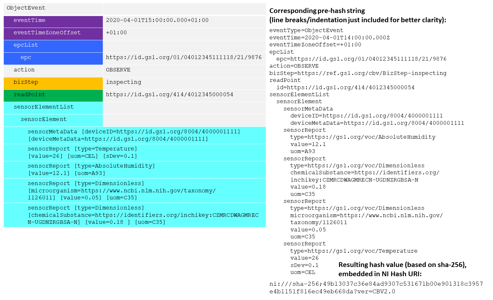

# EPCIS Event Hash Generator

[](https://github.com/RalphTro/epcis-event-hash-generator/actions?query=workflow%3A%22Unit+Tests%22)
[](https://github.com/RalphTro/epcis-event-hash-generator/actions?query=workflow%3A%22Code+Style%22)


This is a proposal/reference implementation for a method to uniquely identify an EPCIS event or validate the integrity thereof. To this end, a syntax-/representation-agnostic approach based on hashing is developed.
The <b>PROTOTYPICAL DEMO SOFTWARE</b> takes an EPCIS Document (either formatted in XML or JSON-LD) and returns the hash value(s) of the contained EPCIS events representing a unique fingerprint thereof. 


## Status of the reference implementation

The current (v1.6.0 at the time of writing) set of examples and implementation of the json parser is based on an old version of the EPCIS 2.0 JSON schema, see https://github.com/RalphTro/epcis-event-hash-generator/issues/37 . Currently, only the XML hashing should be used. See
https://github.com/gs1/EPCIS/blob/master/JSON/
for the current (still draft) version of the JSON schema and for examples.


## TL;DR

The implementation provided here is a prototypical reference implementation meant for testing against other implementations, but **not meant for production**. If you discover that this implementation does not conform perfectly to the algorithm description or contains any other bugs, please file an issue at https://github.com/RalphTro/epcis-event-hash-generator/issues .

### Command Line

The Hashing Algorithm described below is implemented as a python script, including a command line utility which can be run directly.

The package is release on PyPI at https://pypi.org/project/epcis-event-hash-generator/ hence it can be installed via
```
python3 -m pip install epcis_event_hash_generator
```

For usage information run

```
python3 -m epcis_event_hash_generator -h
```


### Web Service

The script also comes wrapped as a web service in a docker image for ease of integration into a testing environment.
You may use 

- [the latest release version of the web service container](https://github.com/RalphTro/epcis-event-hash-generator/packages/484860 ). See here for usage.


## Introduction  
There are situations in which organisations require to uniquely refer to a specific EPCIS event. For instance, companies may only want to store the <b>hash value of a given EPCIS event on a distributed shared ledger ('blockchain')</b> instead of any actual payload. Digitally signed and in conjunction with a unique timestamp, this is a powerful and effective way to prove the integrity of the underlying event data. Another use case consists to use such an approach to <b>populate the eventID field with values that are intrinsic to the EPCIS event</b> - if an organisation captures an event without an eventID (which is not required as of the standard) and sends that event to a business partner who needs to assign a unique ID, they can agree that the business partner populates the eventID field applying this methodology before storing the event on the server. If the organisation later wants to query for that specific event, it knows how the eventID was created, thus is able to query for it through the eventID value.
EPCIS events have a couple of differences to other electronic documents:
+ They are embedded in an EPCIS document that can contain multiple events 
+ As of EPCIS 2.0, it is permitted to capture and share EPCIS data through two different syntaxes (XML and JSON/JSON-LD)
+ EPCIS events provides ample flexibility to include user-specific extensions 
+ When expressed in JSON/JSON-LD, the sequence of elements may vary

This is why industry needs to have a consistent, reliable approach to create a hash value that is viable to uniquely identify a specific EPCIS event. 

Notice that the algorithm described here provides a way of *hashing* an event. A *signature* scheme can be build using this hash, but the hash by itself does not yield a proof of authenticity/authorship. For example, a man in the middle attack can re-compute the hash after tampering.

## Requirements

For any algorithm that is to be considered a faithful hash of an EPCIS event, we require the following properties:

+ Different (valid) serialisations of the **same event** need to yield the **same hash**.
+ In particular, if serialised in XML, the hash must be independend of irrelevant whitespace, ordering of elements in an unordered list, the name used for namespaces, etc. (see e.g. https://en.wikipedia.org/wiki/XML_Signature#XML_canonicalization for more details on the matter).
+ The same event serialised in JSON/JSON-LD or XML must yield the same hash.
+ Any relevant **change of an event** must lead to a **change of the hash**. In particular, the hash must change if
  - any value of any field present in the event is changed.
  - a field is added or removed.


## Algorithm

For hashing strings, well-established algorithms such as SHA-256 are available. The focus of this specification is the canonicalization of a *pre-hash string* representation of an EPCIS event, which can be passed to any standard hashing algorithm. 

To calculate this pre-hash string, the algorithm requires to extract and concatenate EPCIS event key-value pairs to one string exactly according to the following set of rules:
1. For all EPCIS event types, data elements SHALL be extracted according to the *canonical property order* specified below.
2. All elements SHALL be concatenated without separators between successive elements.
3. If a field contains a value (i.e. is not a parent element), each value SHALL be assigned its key through an equal sign ('=').
4. Data elements SHALL NOT be added if they are omitted in a given EPCIS event or do not apply.
5. Whitespace characters at the beginning or end of values SHALL be truncated.
6. Quantitative values SHALL NOT have trailing zeros. (For example, a quantity of one SHALL be expressed as '1', and SHALL NOT be expressed as '1.0'; 0.3434 SHALL be expressed as 0.3434, with any trailing zeros truncated.)
7. Numeric values SHALL be expressed without single quotes.
8. All timestamps SHALL be expressed in UTC; the zero UTC offset SHALL be expressed with the capital letter 'Z'. 
9. All timestamps SHALL be expressed with millisecond precision. If an EPCIS event lacks the latter, the millisecond field SHALL be zero-filled (e.g., YYYY-MM-DDTHH:MM:SS.000Z).
10. Strings SHALL be sorted according to their case-sensitive lexical ordering, considering UTF-8/ASCII code values of each successive character.
11. All child elements as part of a list (e.g. epc in epcList, bizTransaction in bizTransactionList, etc.) SHALL be sequenced according to their case-sensitive lexical ordering, considering UTF-8/ASCII code values of each successive character.
12. If a child element of a list itself comprises one or more key-value pairs itself (e.g. quantityElement in quantityList, sensorReport in sensorElement), the latter SHALL be concatenated to a string (similar to the procedure specified above) and, if they belong to the same level, sequenced according to their case-sensitive lexical ordering, considering UTF-8/ASCII code values of each successive character..
13. If an EPCIS field comprises a type attribute (e.g. Business Transaction Type in bizTransaction or Source/Destination Type in source), the type key-value pair (where the key is 'type' and the value the respective type attribute) SHALL follow the actual key-value before the alphabetical ordering takes place. 
14. If present, any URN-based standard vocabulary value (starting with ‘urn:epcglobal:cbv’) SHALL be expressed in its corresponding GS1 Web Vocabulary URI equivalent (starting with ‘https://ns.gs1.org’).
Example:
‘urn:epcglobal:cbv:bizstep:receiving’ --> ‘https://ns.gs1.org/cbv/BizStep-receiving’

**NOTE: The namespace ‘ns.gs1.org’ is a PLACEHOLDER and still PENDING – please keep it configurable until CBV 2.0 is ratified.**

15. If present, EPC URIs (starting with ‘urn:epc:id’), EPC Class URIs (starting with ‘urn:epc:class’) or EPC Pattern URIs (starting with ‘urn:epc:idpat’) SHALL be converted into the corresponding canonical GS1 Digital Link URI (starting with ‘https://id.gs1.org’). Canonical GS1 Digital Link URIs are specified in [GS1 Digital Link: URI Syntax, release 1.2], section 4.11.
16. If a GS1 Digital Link URI is present, it SHALL take the form of a constrained canonical GS1 Digital Link URI. Specifically: (I) A custom domain SHALL be replaced by ‘https://id.gs1.org’. (II) The query string SHALL be stripped off. (III) It SHALL only contain the most fine-granular level of identification, i.e. contain the following GS1 keys/key qualifiers only: `00 / 01 / 01 21 / 01 10 / 01 235 / 253 / 255 / 401 / 402 / 414 / 414 254 / 417 / 8003 / 8004 / 8006 / 8006 21 / 8006 10 / 8010 / 8010 8011 / 8017 / 8018`
17. If an EPCIS event comprises ILMD elements, the latter SHALL comprise their key names (full namespace embraced by curly brackets ('{' and '}') and the respective local name), as well as, if present, the contained value, prefixed by an equal sign ('='). The resulting substrings SHALL be sorted according to their case-sensitive lexical ordering, considering UTF-8/ASCII code values of each successive character when they are appended to the pre-hash string.
18. If an EPCIS event comprises user extension elements at event level – irrespective whether they appear at top level or are nested – the latter SHALL comprise their key names (full namespace embraced by curly brackets ('{' and '}') and the respective local name), as well as, if present, the contained value, prefixed by an equal sign ('=').
The resulting substrings SHALL be sorted according to their case-sensitive lexical ordering, considering UTF-8/ASCII code values of each successive character when they are appended to the pre-hash string.
19. If an EPCIS event comprises user extension elements as part of an EPCIS standard field with an extension point (namely `errorDeclaration`, `readPoint`, `bizLocation`, `sensorElement`, `sensorMetadata`, and `sensorReport`), the top-level user extension element(s) SHALL be prefixed with the corresponding EPCIS standard field name. Apart from that, the SHALL be added to the pre-hash string similarly as specified in the previous step.
20. The resulting pre-hash string SHALL be embedded in a 'ni' URI scheme as specified in RFC 6920, as follows:
ni:///{digest algorithm};{digest value}?ver={CBV version}
i.e. characters 'n', 'i', followed by one colon (':'), three slash characters ('/'), the digest algorithm, one semicolon (';'), the digest value, one question mark ('?'), the characters 'v', 'e', 'r', one equal sign ('='), and the version of the EPCIS Event Hash ID algorithm that was used to generate the pre-hash string, indicated by the cbv version.
21. The digest algorithm SHALL contain one of the hash name string values as listed in the Named Information Hash Algorithm Registry (see https://www.iana.org/assignments/named-information/named-information.xhtml)
22. The cbv version SHALL be indicated as follows: the three characters 'c', 'b', 'v', followed by one or several digits indicating the major release version, one dot character ('.') and one or more digits indicating the minor release version. In addition, it MAY be appended with one dot character ('.') and one or more digits indicating a revision of a given CBV standard release, if applicable (i.e. if a revision of the CBV standard specifies an updated version of the EPCIS Event Hash ID algorithm).

### Canonical property order 

Applicable for all EPCIS Event Types, i.e. `ObjectEvent`, `AggregationEvent`, `TransactionEvent`, `TransformationEvent` and `AssociationEvent`.

| Sequence | Data Element |
| -------- | ------------ |
| 1 | `eventType` |
| 2 | `eventTime` |
| 3 | `eventTimeZoneOffset` |
| 4 | `errorDeclaration` (`declarationTime`, `reason`, `correctiveEventIDs` – `correctiveEventID`) |
| 5 | `epcList` – `epc` |
| 6 | `parentID` |
| 7 | `inputEPCList` – `epc` |
| 8 | `childEPCs` – `epc` |
| 9 | `quantityList` – `quantityElement` (`epcClass`, `quantity`, `uom`) |
| 10 | `childQuantityList` – `quantityElement` (`epcClass`, `quantity`, `uom`) |
| 11 | `inputQuantityList` – `quantityElement` (`epcClass`, `quantity`, `uom`) |
| 12 | `outputEPCList` – `epc` |
| 13 | `outputQuantityList` – `quantityElement` (`epcClass`, `quantity`, `uom`) |
| 14 | `action` |
| 15 | `transformationID` |
| 16 | `bizStep` |
| 17 | `disposition` |
| 18 | `readPoint` – `id` |
| 19 | `bizLocation` – `id` |
| 20 | `bizTransactionList` – `bizTransaction` (`business transaction identifier`, `business transaction type`) |
| 21 | `sourceList` – `source` (`source ID`, `source type`) |
| 22 | `destinationList` – `destination` (`destination ID`, `destination type`) |
| 23 | `sensorElement` ( |
|    | `sensorMetadata` (`time`, `startTime`, `endTime`, `deviceID`, `deviceMetadata`, `rawData`, `dataProcessingMethod`, `bizRules`), |
|    | `sensorReport` (`type`, `deviceID`, `deviceMetadata`, `rawData`, `dataProcessingMethod`, `time`, `microorganism`, `chemicalSubstance`, `value`, `component`, `stringValue`, `booleanValue`, `hexBinaryValue`, `uriValue`, `minValue`, `maxValue`, `meanValue`, `sDev`, `percRank`, `percValue`, `uom`)|
|    | ) |
| 24 | `ilmd` – `{ILMD elements}` |
| 25 | `{User extension elements}`|

For better understanding, the following illustrations include the data content of EPCIS events (including a couple of user extensions - all defined under 'https://ns.example.com/epcis'), show the corresponding pre-hash string as well as the canonical hash value of that event.

Example 1:


Run `epcis_event_hash_generator/main.py tests/examples/ReferenceEventHashAlgorithm.xml -pj "\n"` to get a similar output of the pre-hash string and `epcis_event_hash_generator/main.py tests/examples/ReferenceEventHashAlgorithm.xml` to verify the hash.

Example 2:



Run `epcis_event_hash_generator/main.py tests/examples/ReferenceEventHashAlgorithm2.xml -pj "\n"` to get a similar output of the pre-hash string and `epcis_event_hash_generator/main.py tests/examples/ReferenceEventHashAlgorithm2.xml` to verify the hash.

Example 3:


The line breaks in the pre-hash string are displayed for readability reasons. The actual pre-hash string does not contain any whitespace (unless specifically used in a value) and the lines displayed in the above picture have to be concatenated (by empty string) in order to get the actual pre-hash string.

## Use Cases and Limitations
This algorithm has *various potential areas of application*:
* Primary Key for EPCIS Events
  - populating the eventID field in situations where this is required
  - enabling to independently recalculate the eventID value on the basis of an EPCIS event's intrinsic data
  - indexing EPCIS events in databases
* Identifying duplicate EPCIS events
* Matching an error declaration to an original event (see EPCIS Standard, section 7.4.1.4)
* Notarisation of EPCIS events (i.e. leveraging digital signatures)  

That said, the algorithm has limited applicability when EPCIS events are redacted (meaning that, e.g. for privacy reasons, EPCIS events are not shared entirely, but deliberately omit specific fields or including readPoint IDs with a lesser granularity - see EPCIS and CBV Implementation Guide, section 6.7). In such a case, the content of a redacted EPCIS event will in no case yield to the hash value of the original one.

## References
* EPCIS Standard, v. 1.2: https://www.gs1.org/standards/epcis
* Core Business Vocabulary (CBV) Standard, v. 1.2.2: https://www.gs1.org/standards/epcis
* RFC 6920, Naming Things with Hashes, https://tools.ietf.org/html/rfc6920
* Named Information Hash Algorithm Registry, https://www.iana.org/assignments/named-information/named-information.xhtml


## License

<br />

Copyright 2020 | Ralph Tröger <ralph.troeger@gs1.de> and Sebastian Schmittner <schmittner@eecc.info>

Permission is hereby granted, free of charge, to any person obtaining a copy of this software and associated documentation files (the "Software"), to deal in the Software without restriction, including without limitation the rights to use, copy, modify, merge, publish, distribute, sublicense, and/or sell copies of the Software, and to permit persons to whom the Software is furnished to do so, subject to the following conditions:

The above copyright notice and this permission notice shall be included in all copies or substantial portions of the Software.

THE SOFTWARE IS PROVIDED "AS IS", WITHOUT WARRANTY OF ANY KIND, EXPRESS OR IMPLIED, INCLUDING BUT NOT LIMITED TO THE WARRANTIES OF MERCHANTABILITY, FITNESS FOR A PARTICULAR PURPOSE AND NONINFRINGEMENT. IN NO EVENT SHALL THE AUTHORS OR COPYRIGHT HOLDERS BE LIABLE FOR ANY CLAIM, DAMAGES OR OTHER LIABILITY, WHETHER IN AN ACTION OF CONTRACT, TORT OR OTHERWISE, ARISING FROM, OUT OF OR IN CONNECTION WITH THE SOFTWARE OR THE USE OR OTHER DEALINGS IN THE SOFTWARE.
